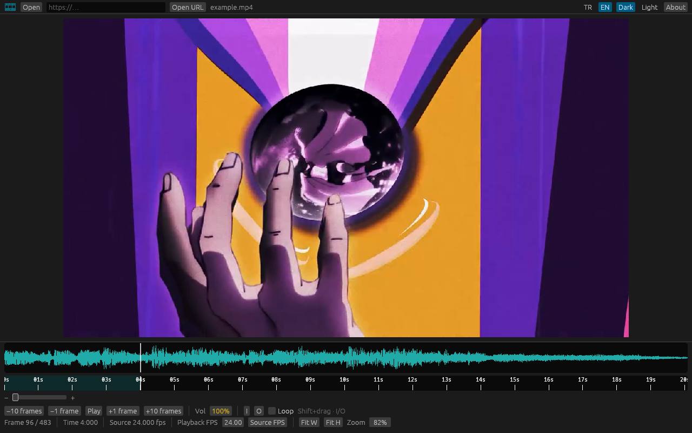

# VFX Player

**Advanced Video Player for VFX Experts** — v0.1.1. Frame-accurate review, not a consumer player. No installer.

  

## Install

1. Download **[vfx_editor.exe](https://github.com/GroophyLifefor/vfx-editor/releases/latest/download/vfx_editor.exe)**
2. Run it. First launch asks **Türkçe / English**.
3. Open a video.

Windows exe. FFmpeg is bundled. That is the whole install.

Windows SmartScreen may warn on the first run (unsigned build). Choose **More info → Run anyway**.

### Open a file

- **Open** in the app
- Drop a video on the window
- Drop a video **on the exe** (or Open with)
- Paste an `http(s)` URL and **Open URL**

## Features

- Frame step **±1 / ±10**, play / pause
- Time as **seconds:ms**, source + playback FPS (2 decimals)
- Timeline: seconds first, frames when zoomed in; wheel / Ctrl+wheel; drag the edges to pan
- Audio waveform + volume **0–125%** (boost above 100%)
- Loop **I / O** (or Shift+drag), wrap on play
- **Trim & save** the loop to a new file, same format
- Preview zoom, Fit W / Fit H, pan when zoomed
- Drag the strips above the waveform and ruler to resize them
- **TR / EN**, dark / light
- If a newer GitHub release exists, an **Update** button appears (offline: nothing happens)

## Language

| Language | Description |
|---|---|
| TR | İlk açılışta dil seç. Exe’yi [Releases](https://github.com/GroophyLifefor/vfx-editor/releases/latest) sayfasından indir, kurulum yok. |
| EN | Pick a language on first launch. Download the exe from [Releases](https://github.com/GroophyLifefor/vfx-editor/releases/latest), no setup. |

Made by [Murat Kirazkaya](https://github.com/GroophyLifefor)
